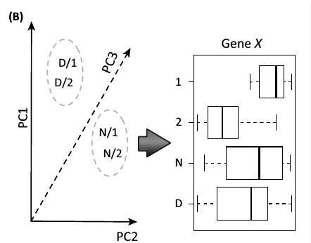
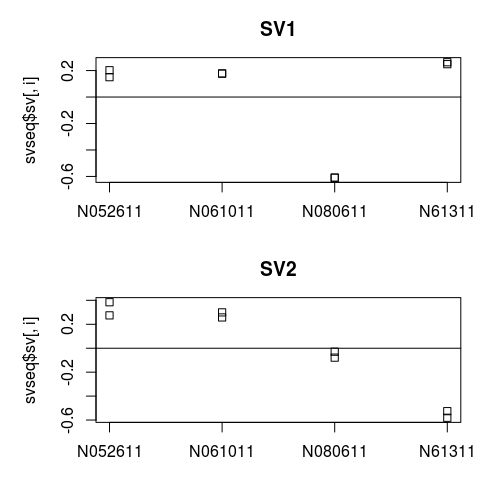

Batch Effects: The Road (Often) Not Taken
=========================================================
author: Saket Choudhary
date: 04/20/2017
autosize: true
incremental: true

========================================================

> Two roads diverged in a wood, and I took the one less traveled by,
And that has made all the difference

-- _Robert Frost_

> When you come to a fork in the road, take it.

-- _Yogi Berra_

What are Batch-Effects?
========================================================

Technical sources of variations that often confound the effects arising from biological differences.

Arise from but not limited to:
- Different processing time
- Different handlers
- Amount of reagent 
- Different instrument or different lanes of same intrument

Why care at all about Batch-Effects?
=========================================================

- Inherent goal of all high-throughput sequencing: Separate signal from noise to understand underlying biology.
- Complicated by latent variables or unwanted hetereogenity
- Most widely recognised latent variable: Batch-effects
- Severly compromising effect on biological and/or statistical validity

Batch-effects are widespread in literature
========================================================

modENCODE: Expressions in tissues are species specific(?!)
========================================================

 
<i>Lin et al., 2014, PNAS</i>

Correcting for batch-effects restablishes well known fact
=========================================================

Human and Mouse tissues are similar, expression wise

 
<i>Gilad et al., 2015, F1000</i>

=== 

In-house example
===

***

Looking for batch effects
========================================================

- RLE: Relative Log Expression 
  - Median subtracted $\log$ values

- PCA/MDS/Heatplots

Looking for batch effects
========================================================

- PCA/MDS aren't often sufficient

Methods
================

- __Co__rrect for __m__easured __Bat__ch Effects : **ComBat** - Johnson et. al., Biostatistics(2007)
- __S__urrogate __V__ariable __A__nalysis : **SVA** - Leek et. al., Plos Genetics (2007); Leek et. al., Bioinformatics(2012)
- __R__emove __U__nwanted __V__ariation : **RUV** - Gagnon-Bartsch et. al., Biostatistics (2007); Risso et. al. Nature Biotech (2014)

RUV --  With replicate/negative controls 
=========================================================
Assume there are genes that can act as negative controls: difference between exp values arises due to unmodelled factors

For  $J$ genes  and $n$ samples  and $k$ unmodelled factors, $p$ known covariates (independent of unmodelled factors):
$$
\begin{align*}
\log E[Y|W,X,O] &= \underbrace{W_{n \times k}}_{\text{Hidden factors design}} \times \alpha_{k \times J} + \overbrace{X_{n \times p}}^{\text{Known covariates design matrix}} \times \beta \\ 
& + \underbrace{O}_{\text{offset}}
\end{align*}
$$

RUV --  With replicate/negative controls 
=========================================================
General Idea, given a pool of $J_c$ negative control genes:

- $Z_c = \log Y_c - O$
- $Z_c* = Z - median(Z_{.j})$
- $Z_c* = U_{n \times n} \Lambda_{n \times J} V^T_{J \times J}$
- Assume $k$ given(how?), estimate $\hat{W\alpha} = U\Lambda_kV^T$ retaining only the highest $k$ lambdas in $\Lambda_k$. $\hat{W} = U\Lambda$
- Substitute $\hat{W}$ to estimate $\alpha$, $\beta$

Can be modified to account for replicates/negative controls, by doing the first pass estimation only on replicate or negative controls.

SVA -- For any unmodelled factors, not just Batch 
=========================================================
For  $g^{th}$ gene  and $j^{th}$ sample </sample>

$$\begin{align*}
\overbrace{Y_{gj}}^\text{Expression} &= \underbrace{\mu_g}_\text{basal expression} + \overbrace{f_g(c_j)}^\text{Dependence on primary variable(say condition)} + \\
&+ \sum_{l=1}^L \underbrace{\gamma_{lg}}_{\text{Gene specific coeff.}} \times \overbrace{p_{lj}}^{l^{th}\text{unmodelled factor(say batch)}} + \underbrace{\epsilon_{gj}}_\text{Noise}
\end{align*}
$$

SVA -- For any unmodelled factors, not just Batch 
=========================================================
General Idea:
- Remove effect due to primary level by obtaining a residual matrix
- For the residual matrix find an orthogonal basis, identifying singular vectors representing more variation than by chance
- Identify subset of genes that account for the significant vectors
- Create a 'surrogate' variable for the subset of these gene subsets

ComBat -- Regress Batch Effects
=========================================================
For $i^{th}$ batch   and    &nbsp;$j^{th}$ sample 

$$
\begin{align*}
\overbrace{Y_{ijg}}^\text{Normalise expression in gene $g$} &= \underbrace{\alpha_g}_{\text{Overall gene exp.}} + \overbrace{X}^{\text{Design Matrix}}\underbrace{\beta_g}_{\text{Regression coeff.}}\\ 
&+ \underbrace{\gamma_{ig}}_{\text{Additive effect}} + \overbrace{\delta_{ig}}^{\text{Multiplicative effect}}\epsilon_{ijg}\\
\gamma_{ig} &= N(Y_i, \tau_i^2) \\
\delta^2_{ig} &= \text{Inverse Gamma} (\lambda_i, \theta_i)\\
\underbrace{Y_{ijg}^*}^{\text{Batch adjusted values} } &= \frac{ Y_{ijg}-\hat{\alpha}_g - X\hat{\beta}_g - \hat{\gamma}_{ig} }{ \hat{\delta}_{ig} } + \hat{\alpha}_g  + X\hat{\beta}_g
\end{align*}\\
$$

What to use and when?
=========================================================

- Batches are known, no other 'unmodelled factor: ComBat
- Batch factors are not known, 'unmodelled factors' with intractable relationships: SVA, RUV
- If Batches are not known, RLE plot and heatmaps are a good proxy to make an informed guess

==========================================================

SVA -- Example
==========================================================
Assume you have 8 treated/control samples coming from 4 cell lines. 
Unmodelled factor - cell line. Can SVA catch it?

***

- SV1 can help differentiate N080611 from 3 others
- SV2 can help differentiate N080611 and N61311
- SV3 should ... ? 

Links
=========================================================
- RLE plots: https://goo.gl/nKLv9b
- RNA-Seq QC + SVA: https://goo.gl/vzu1m4

==========================================================

# Questions?

