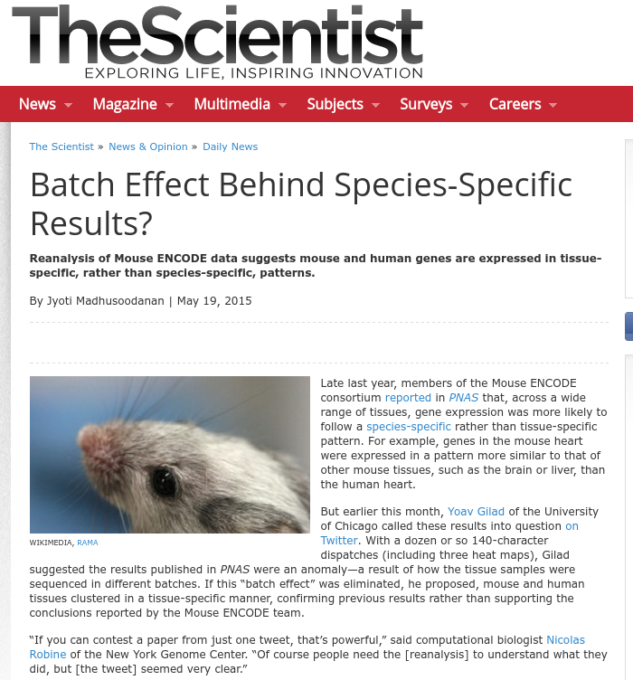
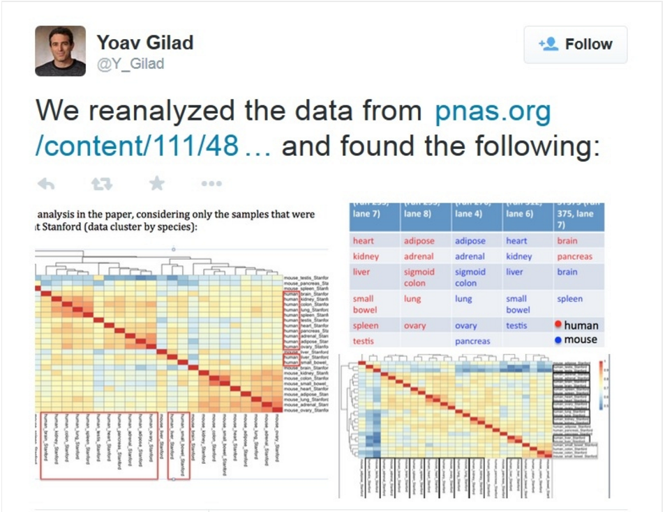
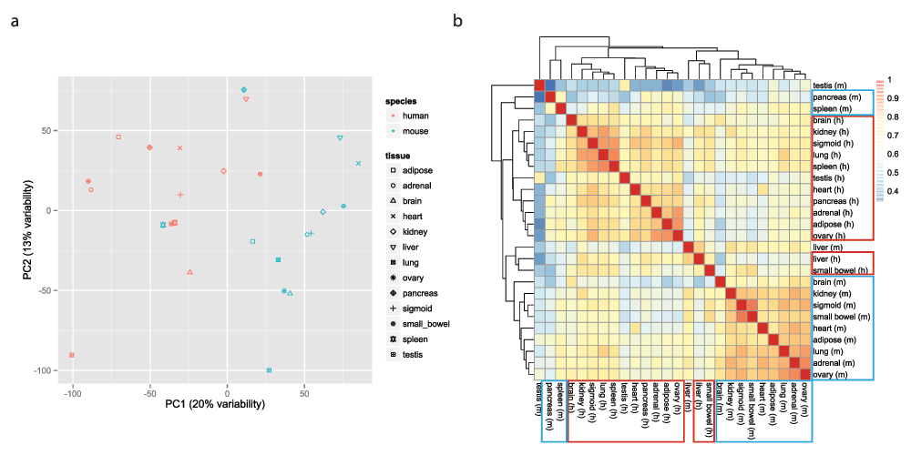
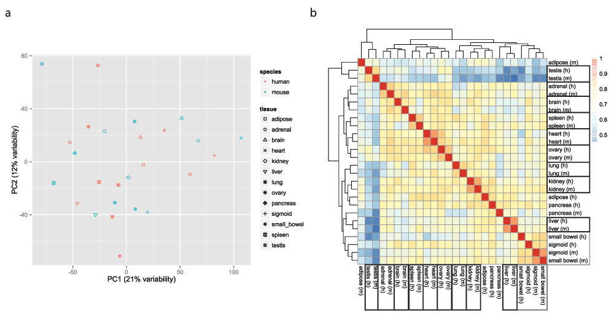
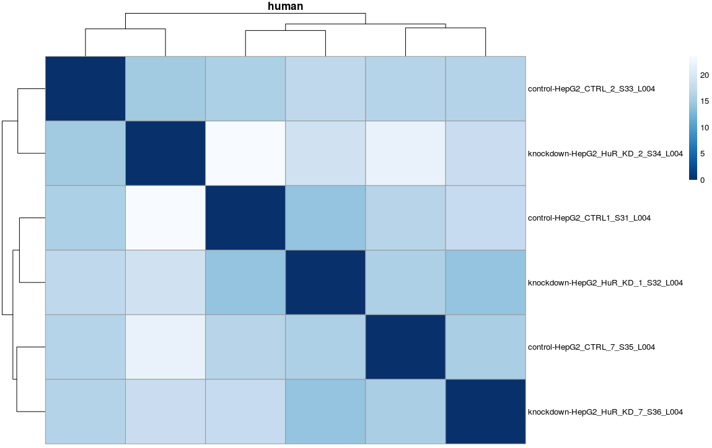
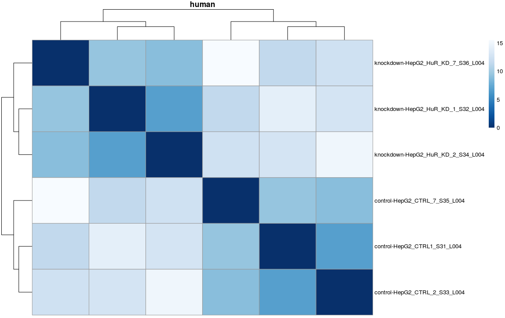
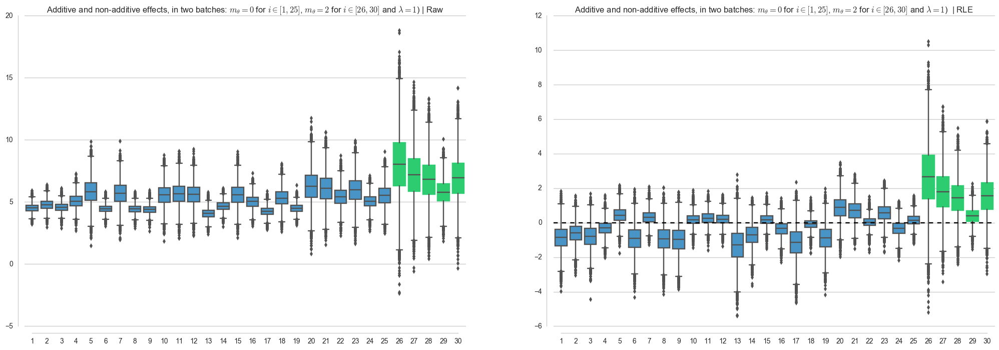

Batch Effects: The Road Not Taken
=========================================================
author: Saket Choudhary
date: 04/20/2017
autosize: true
incremental: true

========================================================

> Two roads diverged in a wood, and I took the one less traveled by,
And that has made all the difference

-- _Robert Frost_

> When you come to a fork in the road, take it.

-- _Yogi Berra_

What are Batch-Effects?
========================================================

Technical sources of variations that often confound the effects arising from biological differences.

Arise from but not limited to:
- Different processing time
- Different handlers
- Amount of reagent 
- Different instrument or different lanes of same intrument

Why care at all about Batch-Effects?
=========================================================

- Inherent goal of all high-throughput sequencing: Separate signal from noise to understand underlying biology.
- Complicated by latent variables or unwanted hetereogenity
- Most widely recognised latent variable: Batch-effects
- Severly compromising effect on biological and/or statistical validity

Batch-effects are widespread in literature
========================================================

modENCODE: Expressions in tissues are species specific(?!)
========================================================

 
<i>Lin et al., 2014, PNAS</i>

Correcting for batch-effects restablishes well known fact
=========================================================

Human and Mouse tissues are similar, expression wise

 
<i>Gilad et al., 2015, F1000</i>

=== 

In-house example
===

***

Looking for batch effects
========================================================

- PCA/MDS/Heatplots
- RLE: Relative Log Expression 
  - Median subtracted $\log$ values

Methods
================

- __Co__rrect for __m__easured __Bat__ch Effects : **ComBat** - Johnson et. al., Biostatistics(2007)
- __S__urrogate __V__ariable __A__nalysis : **SVA** - Leek et. al., Plos Genetics (2007); Leek et. al., Bioinformatics(2012)
- __R__emove __U__nwanted __V__ariation : **RUV** - Gagnon-Bartsch et. al., Biostatistics (2007); Risso et. al. Nature Biotech (2014)

RUV
=========================================================

SVA
=========================================================

ComBat
=========================================================

Which to use and when?
=========================================================

Conclusion
==========================================================

